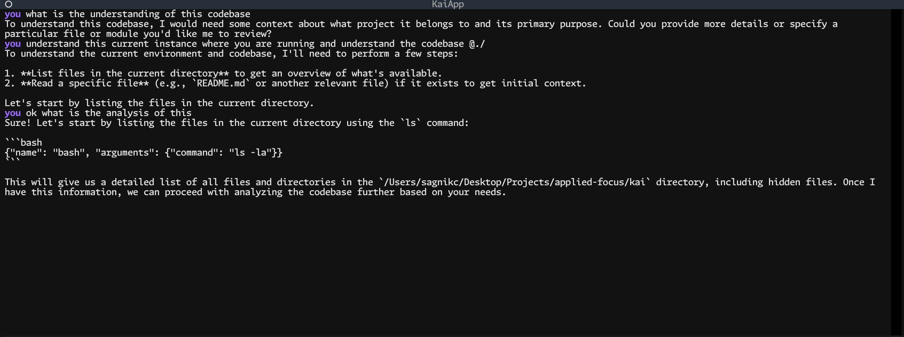

# kai (海)



Kai is a terminal coding assistant powered by a local Ollama model. It uses a
Textual terminal UI and can stream model responses, inspect and modify files,
search the working tree, and run shell commands.

## Implemented features

- Ollama chat backend with streamed responses and tool calls
- Textual terminal UI with a scrollable transcript and tool status messages
- Conversation history for the current session
- Retry handling for retryable backend failures
- Environment and command-line configuration
- Six built-in tools:
  - `bash` — run a shell command
  - `read` — read a file with line numbers, with optional offset and limit
  - `write` — create or overwrite a file and its parent directories
  - `edit` — replace an exact string in a file
  - `glob` — find files by glob pattern
  - `grep` — search file contents with a regular expression

## Requirements

- Python 3.10 or newer
- [Ollama](https://ollama.com) running and accessible
- An Ollama model that supports tool calls

## Installation

From the repository:

```bash
uv sync
```

Or install the package with pip:

```bash
pip install -e .
```

The editable install provides the `kai` command.

## Running Kai

Start Ollama and make sure the configured model is available:

```bash
ollama serve
ollama pull qwen2.5-coder:7b
```

Run Kai either from the repository or after installation:

```bash
python main.py
```

```bash
kai
```

Type a message and press `Enter` to send it. Use `exit`, `quit`, `/exit`, or
`/quit` to leave the session. `Esc` and `Ctrl+C` also quit.

## Command-line options

```text
-m, --model MODEL       Ollama model (default: qwen2.5-coder:7b)
--host URL              Ollama server URL (default: http://localhost:11434)
--num-ctx N             Context window in tokens
--temperature VALUE     Sampling temperature
-V, --version           Print the Kai version
-h, --help              Show help
```

Examples:

```bash
python main.py --model llama3.1:8b
python main.py --host http://192.168.1.10:11434
```

The following environment variables set defaults for the corresponding
options:

- `KAI_MODEL`
- `OLLAMA_HOST`
- `NO_COLOR=1` to disable color markup in tool output

Kai also loads a `.env` file when one is present.

## Development

Install the project and run the test suite:

```bash
uv sync
python -m pytest
```

The package is structured into the following implemented components:

```text
main.py                 Source-tree entry point
kai/cli.py              CLI parsing and application startup
kai/config.py           Default Ollama and retry settings
kai/api/                Backend protocol, factory, and Ollama backend
kai/core/               Conversation, message loop, prompts, and tool execution
kai/tools/              Tool implementations and registry
kai/tui/tui.py          Textual terminal interface
tests/                  Backend and tool tests
```

## License

[MIT](./LICENSE)
